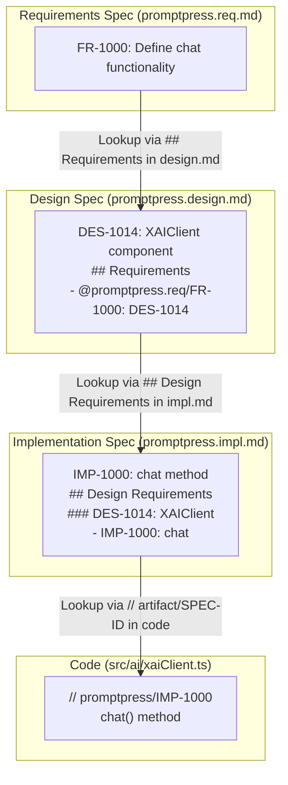

# Architecture Overview

PromptPress is a VS Code extension that enables prompt-driven development by maintaining AI prompts as persistent, versioned Markdown specifications. It follows an SDLC with Requirements (.req.md), Design (.design.md), and Implementation (.impl.md) phases stored in the `specs/` directory. The extension monitors file changes, uses AI (primarily xAI) to refine specs, and generates code from implementation specs.

Key components:

- **File Watchers** (`src/watchers/`): Monitor `specs/` for changes
- **AI Client** (`src/ai/xaiClient.ts`): Handles xAI API interactions
- **Parsers** (`src/parsers/`): Parse markdown specs and file structures
- **Providers** (`src/providers/`): VS Code features for definitions, links, hovers
- **Services** (`src/services/`): Core logic for scaffolding, cascading updates, etc.

## Specs Directory Structure

The `specs/` directory organizes specifications to maintain traceability and sync between requirements, design, implementation, and code. Use this structure to trace intent: start from code (via implementation specs), link to design, then to requirements.

```
specs/
├── ConOps.md                    # Concept of Operations: High-level system overview and operational context
├── TOC.md                       # Table of Contents: Definitions, terms, and cross-references for all specs
├── requirements/                # Functional/Non-Functional Requirements (FR/NFR)
│   └── {artifact}.req.md        # Requirements spec (e.g., promptpress.req.md): Defines what the system must do
├── design/                      # System/Software Design Specifications
│   └── {artifact}.design.md     # Design spec (e.g., promptpress.design.md): Describes how requirements are realized
├── implementation/              # Implementation Plans and Code Generation Specs
│   └── {artifact}.impl.md       # Implementation spec (e.g., promptpress.impl.md): Details file structures, code, and mappings to design/requirements
└── test/                        # Test Specifications
    └── {component}-test.md      # Test specs for components (e.g., xaiClient-test.md): Defines test cases and validation
```

### Tracing Specification Intent

- **Intra-Spec Linking**: Use qualified links like `@artifact.phase/SPEC-ID` (e.g., `@promptpress.req/FR-1000`) or unqualified SPEC-ID assuming the current artifact and appropriate phase. Phase rules: Requirements cannot reference design or implementation; design cannot reference implementation; implementation can reference design and requirements.
- **Code to Specs**: Embed comments in code like `// artifact/SPEC-ID` (e.g., `// promptpress/IMP-1000`) to link methods/classes to implementation specs. The `resolveSpecFilePath` function in `specLinkUtils.ts` parses these to locate the spec file and section.
- **Specs to Code**: Implementation specs list IMP-IDs under DES-IDs (e.g., `### DES-1014: XAIClient - IMP-1000: chat`), describing file structures in tree format. This maps specs directly to generated code.
- **Keeping In-Sync**: When code changes, update impl specs with new IMP-IDs; AI refines via prompts. Use `[AI-CLARIFY: question]` for ambiguities. File watchers trigger cascades.
- **Hints for AI**: Always reference related specs (via `references` in frontmatter). For new code, generate tests immediately. Use regex helpers for patterns.


