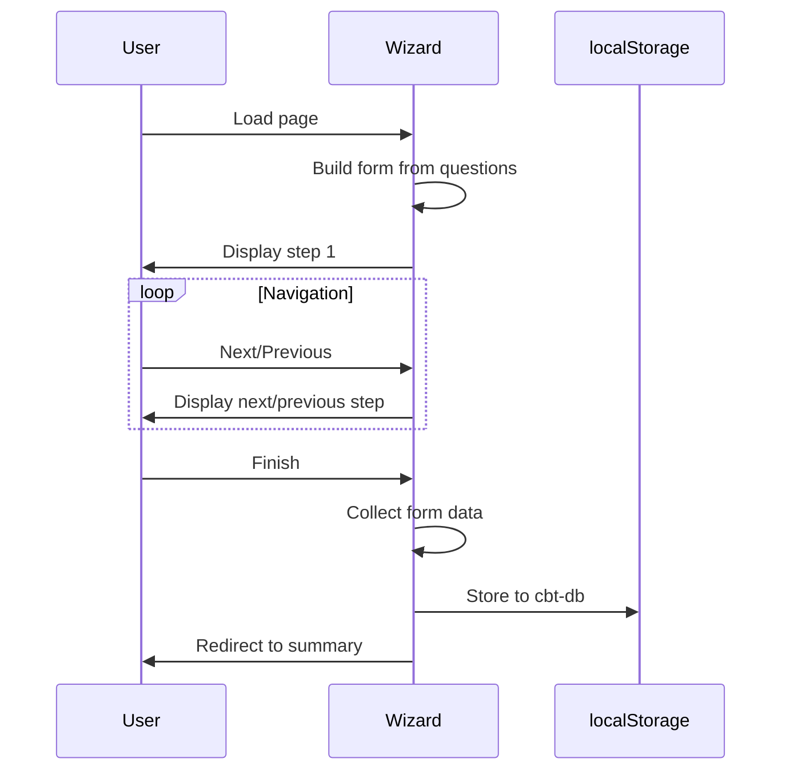
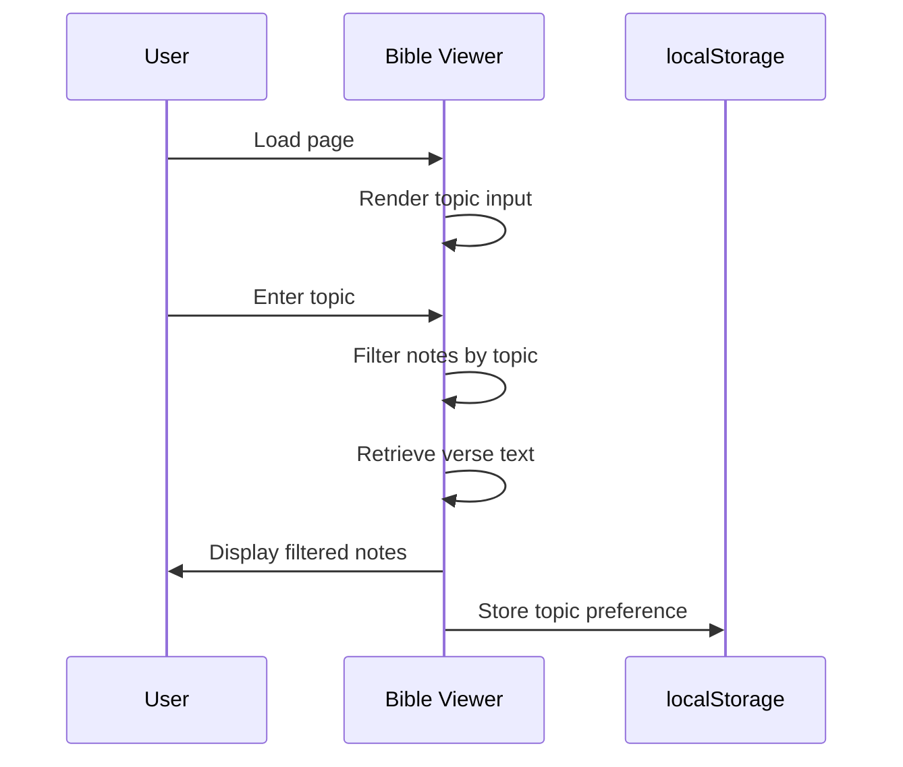

# Requirements Specification for cbt

## Overview
cbt is a cognitive brain training web experience. It guides users through a CBT reflection wizard and a Bible topical viewer to surface scripture notes by topic.

Functional Requirements: FR-1000 to FR-1001
Non-Functional Requirements: NFR-1000 to NFR-1002

## Functional Requirements
### FR-1000
- **Description**: The system shall provide a multi-step CBT reflection wizard that dynamically generates form fields from a predefined question set, allows users to navigate between steps, collects responses, and persists them to localStorage with timestamps. See [CBT Wizard Sequence](#cbt-wizard-sequence).
- **Priority**: High
- **Dependencies**: localStorage API, DOM manipulation, questions data set

### FR-1001
- **Description**: The system shall enable users to input a topic, filter Bible notes by substring match, and display matching verse text alongside annotations, with topic preference persisted to localStorage. See [Bible Viewer Sequence](#bible-viewer-sequence).
- **Priority**: High
- **Dependencies**: Bible scripture data, topic notes index, DOM manipulation, localStorage API

## Non-Functional Requirements
### NFR-1000
- **Description**: The system shall load static data (questions, Bible, notes) efficiently without runtime network requests.
- **Category**: Performance
- **Metrics**: Initial page load time < 1 second on standard hardware.

### NFR-1001
- **Description**: The system shall store user inputs in localStorage without executing embedded scripts or allowing XSS via data display.
- **Category**: Security
- **Metrics**: No script execution from stored data; HTML in notes is not escaped but assumed trusted.

### NFR-1002
- **Description**: The system shall handle invalid book names or verse references gracefully by returning undefined without crashing.
- **Category**: Reliability
- **Metrics**: No runtime errors on invalid data lookups; form assumes valid DOM structure.

## Sequence Diagrams
### CBT Wizard Sequence

### Bible Viewer Sequence

## Use Cases
- **CBT Reflection Session**: User completes the wizard steps, providing responses to questions, which are saved for later review (references FR-1000).
- **Bible Topic Search**: User enters a topic, views filtered scripture notes with text, and topic is remembered (references FR-1001).

## Assumptions
- Browsers support localStorage and modern DOM APIs.
- Static data (questions, Bible, notes) is pre-loaded and trusted.
- Users have JavaScript enabled.

## Constraints
- Client-side only; no server-side processing or data synchronization.
- Data is static; no dynamic updates to questions or Bible content.
- Single-user per browser instance; shared localStorage.

## Notes
- The system is designed for offline use and progressive enhancement.
- Error handling is minimal; assumes correct DOM structure and data validity.